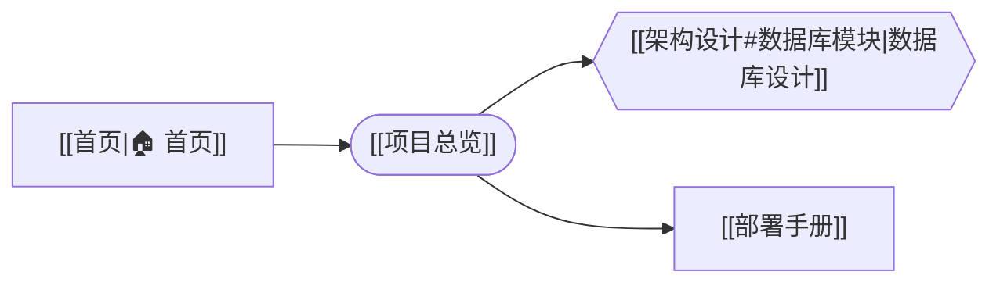

# Mermaid Link Navigator（Obsidian 插件）

在 Mermaid 流程图的**节点里直接写 `[[笔记链接]]`**，阅读模式下 Ctrl/⌘+单击节点即可跳转到对应笔记。支持右键可视化编辑流程图、画布式缩放平移、当前节点一键定位。

## 功能

- **节点嵌入 `[[笔记链接]]`**：支持 `[[笔记]]`、`[[文件夹/笔记]]`、`[[笔记#标题]]`、`[[笔记|显示别名]]`、`[[#本笔记标题]]`
- **Ctrl/⌘+单击节点跳转**（普通左键单击不跳转）：Alt+单击分屏、中键新标签、右键菜单选打开方式
- **右键可视化编辑**（自动写回笔记源码）：
  - 添加节点（可指定上下游节点，笔记链接默认为节点名称）
  - 编辑节点名称和跳转链接
  - 删除节点（入边自动指向出边）
  - 改变形状：矩形 / 圆角矩形 / 圆形 / 菱形 / 六边形 / 圆柱形 / 双边框
  - 添加父节点 / 添加子节点（点击图上任意已存在节点）
  - 设置为判断节点（菱形，是/否分支，是左否右布局）
  - 更换判断节点的【是】/【否】子节点
  - 移除父节点 / 移除子节点（删除对应连线）
  - 更换位置（与另一节点交换显示内容）
  - 设为 / 取消当前节点
- **当前节点一键定位**：设为当前节点后，图上方出现「定位当前节点」按钮，点击自动平移缩放到该节点
- **画布式缩放与平移**：
  - 鼠标滚轮 / Ctrl+滚轮 / 触摸板双指捏合：以指针位置为中心缩放（上滚放大、下滚缩小）
  - 触摸板双指滑动 / 鼠标左键拖动 / 触屏单指拖动：平移
  - 缩放平移状态自动保存，跳转笔记返回或重启后恢复
- **目标笔记不存在时**，节点边框显示为虚线，点击按 Obsidian 规则新建笔记（可指定默认文件夹）
- **笔记重命名自动同步**：重命名笔记后，mermaid 中对应的跳转链接自动更新
- **笔记大纲一键变流程图**：命令面板执行「Mermaid Link Navigator：打开当前笔记的流程图视图」，自动读取标题与列表层级生成 flowchart
- 正常渲染 Mermaid 流程图 / 时序图等全部 Mermaid 图形（内置 Mermaid 11，不依赖网络）
- 主题自动跟随 Obsidian 明暗模式，可在设置中固定
- 兼容桌面端与移动端

## 安装

### 社区插件（推荐）

在 Obsidian「设置 → 第三方插件 → 浏览」中搜索 **Mermaid Link Navigator**，点击安装。

### 手动安装

1. 下载最新 release 的 `main.js`、`manifest.json`、`styles.css`
2. 放到你仓库的 `.obsidian/plugins/mermaid-link-nav/` 目录下
3. 在 Obsidian「设置 → 第三方插件」中启用 **Mermaid Link Navigator**

> 想自行构建：在本目录执行 `npm install`，再执行 `npm run build`。

## 用法

### 推荐写法（节点标签用双引号包起来）

因为链接里含有 `#`、`|` 等符号，建议始终用双引号包裹标签：

````text

````

渲染后：

- A 显示「🏠 首页」，Ctrl+单击打开《首页》
- B 显示「项目总览」，Ctrl+单击打开《项目总览》
- C 显示「数据库设计」，Ctrl+单击跳转到《架构设计》的「数据库模块」标题
- D 显示「部署手册」

### 支持的节点形状

矩形 `[]`、圆角 `()`、圆形 `(())`、菱形 `{}`、六边形 `{{}}`、圆柱 `[()]`、子程序 `[[]]`、旗帜 `>]`、平行四边形 `[/ /]` 等全部 flowchart 节点形状均可。

### 右键编辑

在流程图节点上右键，即可看到所有编辑选项。所有编辑操作都会自动写回笔记中的 mermaid 源码。空白处右键可添加新节点。

### 判断节点

右键节点 →「设置为判断节点」，依次点击选择【是】和【否】的子节点。判断节点显示为菱形，【是】分支自动排在左侧、【否】分支在右侧。后续可右键 →「更换【是】节点」/「更换【否】节点」单独修改。

### 当前节点定位

右键节点 →「设为当前节点」，流程图上方出现绿色「🎯 定位当前节点」按钮，点击后自动平移缩放到该节点位置（不隐藏其他节点）。

## 设置项

| 设置 | 说明 |
| --- | --- |
| 接管原生 mermaid 代码块 | 普通 mermaid 块是否由本插件渲染，改后需重新加载插件 |
| 额外生效的代码块语言 | 逗号分隔的别名，如 `mmd` |
| 图表主题 | 自动 / 浅色 / 深色 / forest / neutral |
| 默认打开方式 | 当前标签页 / 新标签页 / 左右分屏（修饰键优先级更高） |
| 新笔记默认文件夹 | 节点链接不存在时，自动创建笔记的目标文件夹（不存在则自动创建） |
| 单击/双击判定延时 | 默认 220ms，防止双击时误触发跳转 |
| 悬停提示 | 鼠标悬停节点时显示目标笔记 |
| 悬停高亮 | 高亮可点击节点 |

命令面板中还提供「重新渲染当前笔记中的 Mermaid 链接图」命令，切换主题后可手动刷新。

## 注意事项

- 链接写在**节点**上才会绑定点击；写在连线标签（`-->|文字|`）上只会显示别名，不可点击。
- 一个节点里写多个链接时，第一个链接作为跳转目标，其余仅替换为显示文本。
- Ctrl/⌘+单击才会跳转，普通左键单击不跳转（避免误触）。

## 目录结构

```text
mermaid-link-nav/
├── manifest.json        插件清单
├── main.js              构建产物（直接安装用）
├── styles.css           样式
├── src/
│   ├── main.ts          插件主逻辑：代码块渲染、跳转、右键编辑、设置页
│   ├── diagram-edit.ts  mermaid 源码编辑：添加/编辑/删除节点、改变形状、判断节点等
│   ├── parser.ts        mermaid 源码解析：节点 wikilink 与连线关系提取
│   ├── pan-zoom.ts      画布式平移缩放控制器
│   ├── focus-dom.ts     viewBox 缩放动画
│   ├── outline.ts       笔记大纲树解析 + 大纲转 mermaid flowchart
│   ├── outline-view.ts  「笔记流程图」ItemView
│   ├── edit-modal.ts    节点编辑弹窗
│   └── node-id.ts       从渲染后 DOM 还原源码节点 id
├── esbuild.config.mjs   构建脚本
├── tsconfig.json
└── package.json
```
